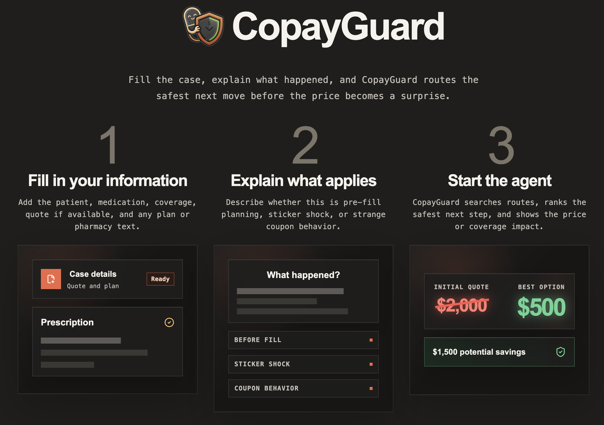
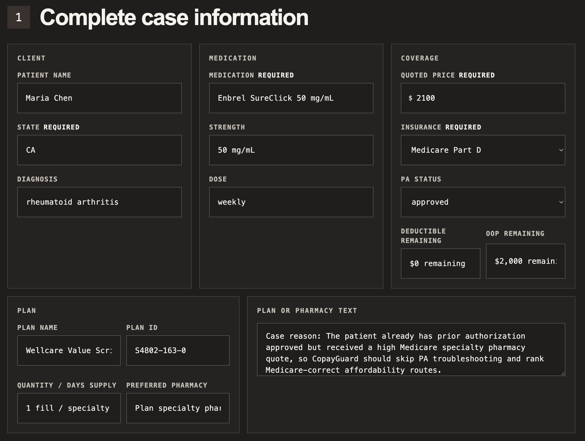
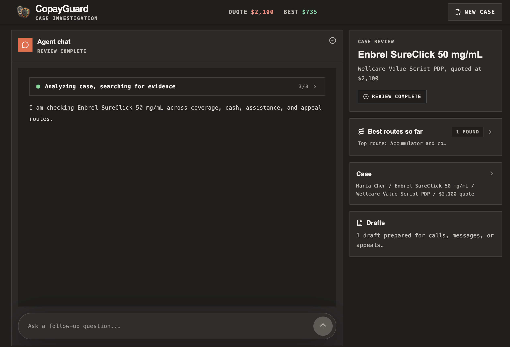

# Healthcare Medication Access Hackathon

This repository is the result of a one-day healthcare-focused hackathon project. The
prototype app is called **CopayGuard**.

The idea was to build a practical tool for ordinary patients who get to the pharmacy and
find out that their medication is still expensive, even with insurance. Prescription access
is full of confusing edge cases: high quotes, prior authorizations, specialty tiers,
deductibles, copay cards, coupon traps, Medicare restrictions, patient assistance programs,
foundation grants, and cash-price alternatives. I wanted to explore whether an agentic app
could help people understand what is happening and find the next best route to make a
prescription more affordable.

The project ended up as a partially working prototype rather than the polished product I
had in mind. It has an intake flow, premade sample cases, a random case generator, a
medication affordability workspace, curated healthcare source links, and an agent-style
review panel. It is not a production healthcare product, a live PBM price oracle, or a tool
that should be used for medical or insurance decisions without verification.

## Screenshots

### Landing Page

This is what the user sees when the website first loads.



### Prescription Intake

This is the section where the user can enter prescription, insurance, pharmacy, quote, and
plan-context information.



### Agent Review

This is the workspace where the agent works through the case and interacts with the person.



## What I Built

CopayGuard tries to cover three common medication affordability moments:

1. **Before fill**: check whether a prescription is likely to run into price, prior
   authorization, step therapy, quantity limit, pharmacy network, or alternative-drug issues.
2. **At sticker shock**: explain a high pharmacy quote and route the patient between
   insurance, cash pricing, coupons, manufacturer support, patient assistance, foundation
   grants, payment smoothing, exceptions, or appeals.
3. **After weird coupon behavior**: detect cases where a copay card lowers the immediate
   charge but may not count toward the deductible or out-of-pocket maximum.

The agent is meant to be eligibility-aware. For example, a commercial insurance patient
may be routed toward manufacturer copay support, but a Medicare Part D patient should not
be told to use a normal commercial copay card. That patient may need Extra Help screening,
foundation grants, Medicare Prescription Payment Plan information, free-drug support, or
appeal preparation instead.

## What Worked

- The project became a concrete medication affordability workflow instead of a generic
  healthcare chatbot.
- The sample cases made the product easier to understand: pre-fill pricing, a high Medicare
  specialty quote, and a commercial coupon/accumulator issue.
- The UI made the idea feel tangible. There is a clear intake, sample selection, agent
  review state, source list, route ranking, and draft/action area.
- The backend and frontend are connected through typed endpoints, persisted sessions,
  streaming-style agent events, and local fallbacks for demoability.
- The work helped me understand how messy medication affordability is. The useful product
  is not just "find a coupon"; it has to separate eligibility, insurance rules, cash flow,
  deductible impact, and what the patient can actually do next.

## What Did Not Work

- I started building while still learning the problem space. I knew medication costs were a
  real market problem, but I had not spoken to enough people dealing with it directly and I
  did not fully understand which exact user pain would create the most impact.
- I spent too much hackathon time on UI and visual polish. It was fun to experiment with
  different frontends, but for a one-day hackathon the winning path was probably more
  functionality and clearer demo value, not a perfect interface.
- I should have built the core agent view and tool loop first. The highest-leverage demo
  was the agent finding routes, using tools, preparing drafts, and making the next step
  obvious. I spent too much time on intake and surrounding structure before making that core
  loop excellent.
- I let AI generate too much of the AI-calling and tool-use code. The result was buggy and
  did not match the output shape I wanted. For this kind of agent workflow, I should have
  hand-defined the tool inputs, outputs, state transitions, and response contracts first.
- The project did not use voice, even though voice was a major hackathon theme. There was
  room to use voice for calling pharmacies or assistance programs, guiding the UI, or
  letting a patient explain their situation naturally.

## What I Learned

- A healthcare hackathon project needs a sharper problem definition before the build starts.
  In a short event, every unclear product decision becomes expensive.
- Domain discovery matters. I should have talked to people who had actually struggled with
  prescription access, pharmacy quotes, insurance denials, or copay card surprises.
- The highest-leverage demo path should be built first. Once the core "wow" workflow works,
  intake, polish, and secondary features can be layered around it.
- Agent tooling needs explicit contracts. Models can help implement code, but for tool use I
  should define schemas, tool responsibilities, state updates, and final output formats by
  hand.
- Good healthcare software is less about sounding smart and more about being precise about
  eligibility, evidence, uncertainty, and the next action.

## What I Would Improve Next

- Make appeal letters, pharmacy call scripts, assistance packets, and exception requests
  visible and editable directly in the app.
- Connect to real data sources where patients can pull plan, eligibility, claim, or
  pharmacy information when available.
- Add voice support for explaining the case, controlling the UI, or helping with phone-call
  workflows.
- Explore browser automation for filling assistance forms, checking program eligibility, or
  visiting official resources on behalf of the user with confirmation.
- Ground the agent in more trustworthy sources and make it show exactly which route depends
  on which eligibility fact.
- Build a smaller but stronger first demo: one user, one medication-cost problem, one clear
  before-and-after outcome.

## Tech Stack

| Layer | What |
|---|---|
| API | FastAPI, async SQLAlchemy 2.0, Alembic, pydantic-settings |
| DB | Postgres 16 via `docker-compose.yml` |
| AI | Pydantic AI agent using xAI Grok, streaming endpoints, prompts in `prompts/` |
| Frontend | Vite + React + TypeScript + Tailwind |
| Quality | ruff, pyright, pytest, git hooks, `bin/check`, GitHub Action |

## Run Locally

Prereqs: `uv`, Node from `.nvmrc`, and Docker. OrbStack works as the Docker runtime.

```bash
cp .env.example .env
uv sync
npm --prefix frontend install
docker compose up -d --wait db
uv run alembic upgrade head
git config core.hooksPath .githooks
bin/dev
```

Open `http://localhost:5173`.

To enable the app's main AI agent, add `GROK_API_KEY` or `XAI_API_KEY` to `.env` and restart
`bin/dev`.

Useful commands:

```bash
bin/dev          # Postgres + API on :8000 + frontend on :5173
bin/check        # full quality gate
bin/up           # just Postgres + migrations
bin/db shell     # psql into the DB
bin/db reset
```

## Project Map

```text
app/
  main.py        # FastAPI app, routers registered here
  config.py      # typed settings from .env / environment
  models/        # SQLAlchemy models
  schemas/       # Pydantic request/response models
  services/      # DB logic
  routers/       # HTTP endpoints
  agents/        # Pydantic AI agent + tools
api/index.py     # Vercel Python entrypoint
prompts/         # agent system prompts
frontend/src/    # React app
docs/            # planning notes and README assets
tests/           # pytest against a real Postgres test database
```
